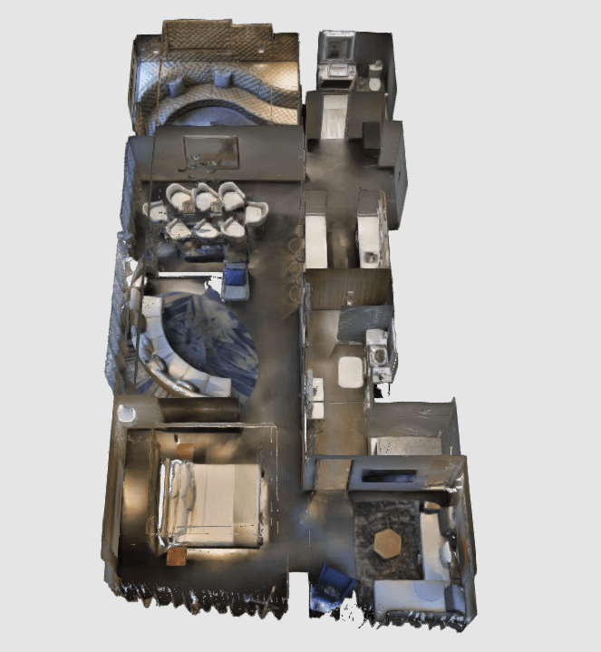

# CMU_VLA_Challenge_base
The instructions provided in this folder are based on the [CMU-VLA-Challenge](https://github.com/HaochenZ11/CMU-VLA-Challenge).
The underlying code is derived from the [Autonomous Exploration Development Environment](https://www.cmu-exploration.com).

## 1. AI Habitat-Sim using Matterport3D Datasets
### 1.1 Installations
```bash
sudo apt update
sudo apt install libusb-dev
```

```bash
https://github.com/iminolee/CMU_VLA_Challenge_base.git

cd CMU_VLA_Challenge_base/system/matterport
catkin_make
```

```bash
conda create --name habitat --file habitat_spec_file.txt
conda activate habitat
conda install -c conda-forge -c robostack ros-noetic-desktop
```

### 1.2 Data Preparation
* [Download Matterport3D scene dataset (ID:17DRP5sb8fy) as an example](https://drive.google.com/file/d/1JvNxM0vLYubGY-vMKvTh1sj0K7meybGE/view?usp=drive_link)

<p align="center">
  
</p>

The prepared environment model files should look like the following:

```
CMU_VLA_Challenge_base
├── system
│   └── matterport/src/vehicle_simulator/mesh
│       └── matterport
│           ├── meshes
│           ├── pointclouds
│           ├── segmentations
│           ├── model.config
│           └── model.sdf
└──  ...
```

### 1.3 System Launch
In a terminal, go inside this folder and bring up the system:
```bash
./system_bring_up.sh
```
<p align="center">
  
</p>

If the system does not launch correctly, open the system_bring_up.sh file in a text editor and check if the paths defined at the top, i.e. CONDA_DIR, CONDA_BIN_DIR, CONDA_SETUP_FILE, CONDA_PROFILE_FILE, match the Anaconda installation on your computer. If the system is still not working, **users can launch the autonomy system and AI Habitat in two separate terminals**. In a terminal, go inside this folder and bring up the autonomy system:

```bash
source devel/setup.sh 
roslaunch vehicle_simulator system_matterport.launch
```
In a second terminal, go to the `/src/segmentation_proc/scripts` folder and run AI Habitat:

```bash
conda activate habitat
python3 ./habitat_online_360_v0.2.1.py
```

### 1.4 Joystic Navigation (Optional)
Note that users can use a PS3/4 or Xbox controller with a USB or Bluetooth interface instead of the virtual joystick (If using the Xbox Wireless USB Adapter, please install [xow](https://github.com/medusalix/xow)). Users can use the right joystick on the controller to navigate the vehicle. Holding the obstacle-check button cancels obstacle checking and clicking the clear-terrain-map button reinitializes the terrain map. To resume waypoint navigation, hold the mode-switch button and at the same time push the right joystick. Doing so will allow the right joystick to control the speed. If only holding the mode-switch button, the system will use the default speed.

```bash
sudo apt install ros-noetic-joy
# Identifying the correct device. For example, it may be called, `js1`, `js2` etc.
ls /dev/input/ 
rosrun joy joy_node _dev:=/dev/input/js1
```

<p align="center">
  
  &nbsp;&nbsp;&nbsp;&nbsp;
  
</p>